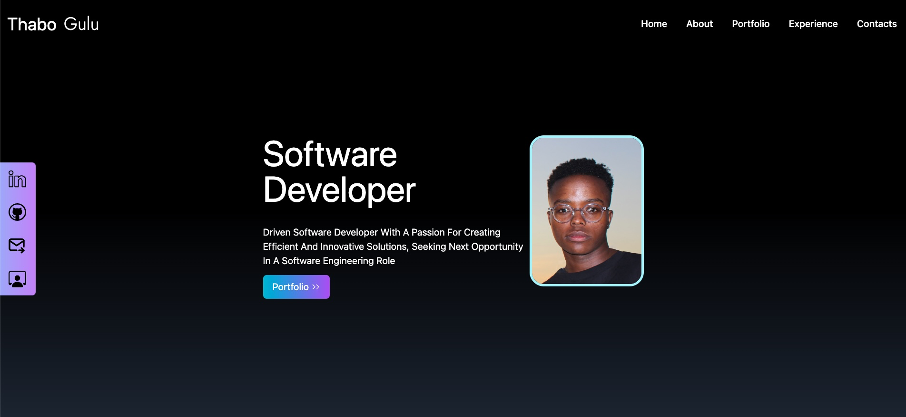

# Portfolio Website

## 1. URL: https://websiteby.thabogulu.com/

This is a portfolio website showcasing my skills as a junior software engineer, with a focus on Javascript, HTML, CSS, and Android development. The website is built using React and written in JSX, with styling done using Tailwind CSS.

## 2. Features

The website includes the following features:

Home page with a brief introduction and links to other sections of the website
Projects page showcasing some of my past projects, including screenshots and descriptions
Skills page detailing my proficiency in various programming languages and tools
Contact page with a contact form for potential employers or collaborators to get in touch with me

## 3. Technologies Used

The website is built using the following technologies:

1. React JSX
2. Tailwind CSS

## 4. How to Run the Website

To run the website locally, follow these steps:

Clone the repository to your local machine
Install the required dependencies using npm install
Run the development server using npm start
Open your web browser and navigate to http://localhost:3000

## 5 Image of Portfolio

